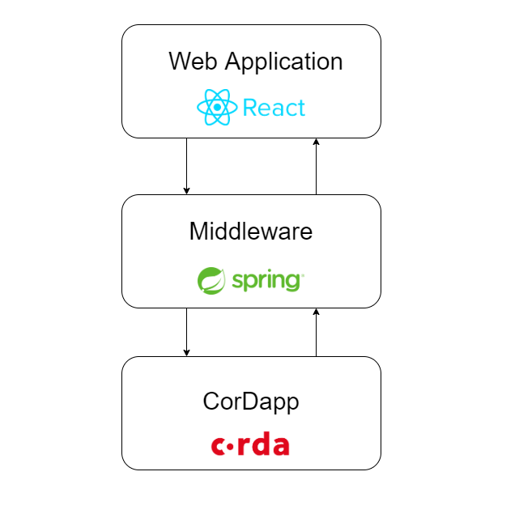

# Aud-IT
A repository containing the code implementation for DLT4PI practical course for IT Compliance

The goal of _Aud-IT_ is to make IT compliance easier for financial service providers. It optimizes the auditing processes for auditors and supervisory authorities.

#### Current auditing process:

- A supervisory authority issues a regulation and publishes it in text form on its website

 - Most financial service providers (FSPs) are required by law to be audited at least once a year. They then mandate an auditor to verify their compliance with all relevant regulations. 

- The FSP claims its compliance to the regulations and has to prove his claims to the auditor

- If the auditor is not convinced by the proof provided by the FSP or considers the proven claims not sufficient to prove compliance, he can request examining terabytes of logs from all IT systems of the FSP. This process is long and very demanding.

Due to lack of standardized claims and evidence generating algorithms on which both the auditor and the supervisory authority agree, the FSP often delivers not sufficient proven claims and the auditor ends up examining large log-files


#### Our solution:

With _Aud-IT_ we attempt to solve the problem of standardized claims on which agree the FSP, the auditor and the supervisory authority. We leave the problem of standardized evidence generating algorithms and evidence representation for future work and contributions.

Our proposed auditing process:

- A supervisory authority issues references to regulations (including their content) to a DLT network in which auditors and FSPs particpate as well

- FSPs and auditors suggest claim templates for each rule of the newly issued regulation. These templates are examined by the supervisory authority and only claim templates, which would prove compliance when verified, are accepted and broadcasted to all parties.

- Each FSP instantiates the regulation graph consisting of regulations, rules and claim templates. They then extend this graph with claims specific to their IT systems and logs (we call them specific claims) and submit these with attachments containing the evidence to the network and share it only with the respective supervisory authority and auditor.

- When auditing the auditor doesn't need to check the FSP claims, since he and the supervisory authority already agreed on. He only needs to check the evidence representation attached to the specific claim. 

We believe that this approach reduces the probability that an auditor has to go through large amounts of data especially when the provided evidence representation displays a clear proof to the specific claim. 


The project consists of three main modules:



## Requirements

_Aud-IT_ was tested on Windows 10 and Mac OS with 64-Bit CPU. To be able to run it your system needs to have these requirements installed:

- Java 8
- Docker Desktop >= 4.8.1
- Docker Engine Version >= 20.10.14
- ...


## Quick Start

#### Clone this repository:

```console
$ git clone https://github.com/DLT-EarlyBirds/it-compliance.git
```

#### Deploy the nodes:

Run this command in the repository root:

```console
.\gradlew.bat clean deployNodes
```

#### Run the CorDapp on Docker Compose
To run the network based on docker compose you need to first start the docker deamon by starting Docker Desktop Community Edition.
Then you can simply run the command `docker compose up` in the directory `it-compliance/build/nodes`to deploy the network.


#### Start the middleware application:
 To start the middleware spring boot application you have to find out the RPC ports for each node's docker container and copy it to the variable `--config.rpc.port` in `clients/build.gradle`. 
 
After that start the gradle tasks in `clients/build.gradle` for the servers you want to run. 

#### Start the web application:
...

#### Create a test regulation:
...

## More Details:
If you need more details about the individual components please refer to the respective documentation page:

-   [CorDapp](docs/cordapp.md)
- [Middleware](docs/middleware.md)
- [Web Application](docs/webapp.md)
