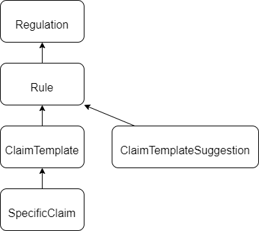

## Running the network
The compliance network for the prototype is based on five dockerized nodes that are communicating via a shared network.
We are using docker compose to run the network and the client applications, as well as the CorDapps within.

### Deploying the network
To deploy the network you need to run the gradle task called `deployNodes`. The task creates the directory `/it-compliance/build`.
Located inside this directory is a directory called `/it-compliance/build/nodes` containing all of the peer nodes of the prototype network, as well as the file `/it-compliance/build/nodes/docker-compose.yaml`.

#### Run Network on Docker Compose
To run the network based on docker compose you need to first start the docker deamon by starting Docker Desktop Community Edition.
Then you can simply run the command `docker compose up` in the directory `it-compliance/build/nodes`to deploy the network.

#### Interacting with the nodes
You can interact with the nodes via a client or via the commandline. As we have not yet developed a client you can use the [Node Expolorer](https://docs.r3.com/en/platform/corda/4.6/open-source/node-explorer.html) as a client, or log into the node via ssh.

##### Logging in via ssh
To log in via ssh you need to run the following command in your preferred shell (assuming you have ssh installed):
```
ssh -p <NODE_PORT> localhost -l user1
```
Replace `<NODE_PORT>` with the port of the node you want to connect to. You can find the respective nodes in the `build.gradle` file located at `it-compliance/build.gradle`.
The username is already provided with `user1`, the respective password is `test`.

# States:
In the CorDapp there are five possible states with the following referencing hierarchy: 



Together they build what we call a regulation graph. It is a DAG (**D**irected **A**cyclic **G**raph) that specifies the law regulations, their rules (sub-regulations) and the claims that need to be proven by a financial service provider to be compliant to the laws.

The code that defines the states can be found here:

`contracts/src/main/java/com/compliance/states`

# Contracts:

For each of the above-mentioned states we define a smart contract that checks for the validity of its allowed transactions. The contracts can be found here:

`contracts/src/main/java/com/compliance/contracts`


# Issuing flows:

## Regulations

### Create Regulation Flow
`flow start CreateRegulation name: Regulation, description: Some Description, version: 0.1, releaseDate: 2022-03-22`

`run vaultQuery contractStateType: com.compliance.states.Regulation`

### Deprecate Regulation Flow
`flow start DeprecateRegulation linearId: <RegulationLinearId>`

### Update Regulation Flow
`flow start UpdateRegulation name: Regulation2, description: Some Description, version: 0.2, releaseDate: 2022-03-22, linearId: <RegulationLinearId>`

## Rules

### Create Rule Flow
`flow start CreateRule name: NewRule, ruleSpecification: new Description, parentRegulationLinearId: <RegulationLinearId>`

`run vaultQuery contractStateType: com.compliance.states.Rule`

### Update Rule Flow

`flow start UpdateRule linearId: <RuleLinearId>, name: NewRule2, ruleSpecification: new Description, parentRegulationLinearId: <RegulationLinearId>`

### Deprecate Rule Flow
`flow start DeprecateRule linearId: <RuleLinearId>`

## Claim Templates

### CreateClaimTemplate Flow
`flow start CreateClaimTemplate$CreateClaimTemplateInitiator name: NewClameTemplate, description: new Description, ruleLinearId: <RuleLinearId>`

`run vaultQuery contractStateType: com.compliance.states.ClaimTemplate`

### UpdateClaimTemplate Flow
`flow start UpdateClaimTemplate name: NewClameTemplate, templateDescription: new Description, rule: <RuleLinearId>`

## Claim Template Suggestions

### CreateClaimTemplateSuggestion Flow
`flow start CreateClaimTemplateSuggestion$CreateClaimTemplateSuggestionInitiator name: TemplateSuggestion, description: This is template suggestion, supervisoryAuthority: SupervisoryAuthority, ruleLinearId: <ruleId>`

`run vaultQuery contractStateType: com.compliance.states.ClaimTemplateSuggestion`

### AcceptClaimTemplateSuggestion Flow
`flow start AcceptClaimTemplateSuggestion linearId: <claimTemplateSuggestionId>`

## Specific Claims

### CreateSpecificClaim Flow

#### Without referencing an attachment
`flow start CreateSpecificClaim name: SpecificClaim, description: This is a specific claim, supervisoryAuthority: Supervisory Authority, auditor: Auditor, claimTemplateLinearId: <ClaimTemplateLinearId>, supportingClaimsLinearIds: []`

`run vaultQuery contractStateType: com.compliance.states.SpecificClaim`

#### With referencing an attachment
`flow start CreateSpecificClaim name: SpecificClaim, description: This is a specific claim, supervisoryAuthority: Supervisory Authority, auditor: Auditor, claimTemplateLinearId: <ClaimTemplateLinearId>, supportingClaimsLinearIds: [], attachmentID: <attachmentID>`

`run vaultQuery contractStateType: com.compliance.states.SpecificClaim`

### UpdateSpecificClaim Flow

#### Without referencing an attachment
`flow start UpdateSpecificClaim specificClaimLinearId: <linearID>, name: SpecificClaim, description: This is a specific claim, supervisoryAuthority: Supervisory Authority, auditor: Auditor, claimTemplateLinearId: <ClaimTemplateLinearId>, supportingClaimsLinearIds: []`

#### With referencing an attachment
`flow start UpdateSpecificClaim specificClaimLinearId: <linearID>, name: SpecificClaim, supervisoryAuthority: Supervisory Authority, auditor: Auditor, claimTemplateLinearId: <ClaimTemplateLinearId>, supportingClaimsLinearIds: [], attachmentID: <attachmentID>`


# Handling Attachments

## Add an attachment to a node
`run uploadAttachment   jar: path\to\attachment.zip`

`attachments trustInfo`

## Add an attachment with meta data
`run uploadAttachmentWithMetadata   jar: path\to\attachment.zip, uploader: Peter, filename: test.zip`

## Download an attachment
`run openAttachment id: <attachmentID>`

`path\to\save\attachment.zip`

## Copying files to a docker container from the host server
If the nodes are running in docker containers then you can't just copy files from the host server to the Corda attachments pool. The files must be copied to the container file system first:

`docker cp path\on\host_server\attachment.zip node_container_id:path/in/container/attachment.zip`

Then from there upload the attachment to Corda:

`run uploadAttachment   jar: path/in/container/attachment.zip`


## Copying files from a docker container to the host server
First download the attachment to the container file system:

`run openAttachment id: <attachmentID>`

`path/in/container/attachment.zip`

Then copy it to the host server:

`docker cp node_container_id:path/in/container/attachment.zip path\on\host_server\attachment.zip`
